# Hybrid Edge-AI Motor Fault Detection & Self-Healing System

ESP32-based intelligent motor monitoring and predictive maintenance system using Edge AI, TinyML, and multi-sensor fusion for real-time fault detection without cloud dependency. 

---

# Overview

This project implements a complete Edge-AI motor protection pipeline on ESP32 using:

- OneClassSVM anomaly detection
- Autoencoder reconstruction analysis
- Mahalanobis statistical distance
- Ensemble fusion scoring
- Adaptive EMA baseline tracking
- Multi-sensor validation
- EEPROM persistent fault logging
- Self-healing fault recovery logic

The system performs all inference locally on ESP32 with ultra-low latency (<1ms), enabling industrial-grade intelligent monitoring for motors, pumps, and rotating machinery.

---

# Key Features

- Real-time Edge AI inference
- TinyML deployment on ESP32
- Multi-sensor fusion architecture
- Ensemble anomaly detection
- Adaptive EMA baseline tracking
- Statistical + ML hybrid detection
- Fault classification pipeline
- Cloud-independent operation
- Patent-ready ML architecture
- Industrial predictive maintenance workflow

---
#  Tech Stack & Requirements
#  Tech Stack & Requirements

<div align="center">


</div>

---
---

# Edge-AI Inference Pipeline

The deployed inference pipeline contains 5 sequential detection stages:

1. Feature normalization
2. OneClassSVM inference
3. Mahalanobis distance analysis
4. Physics-based sensor validation
5. Weighted ensemble fusion scoring

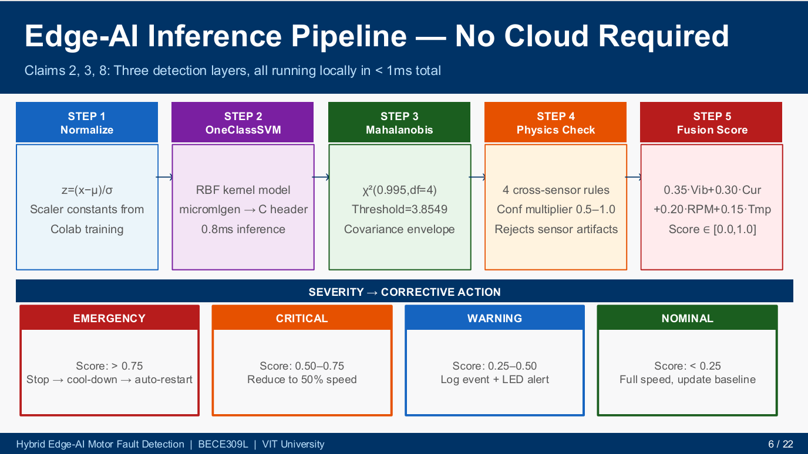

---

# ML Training Pipeline

The ML training workflow includes:

- Synthetic dataset generation
- Feature scaling
- OneClassSVM training
- Autoencoder training
- Mahalanobis threshold modeling
- Ensemble fusion optimization
- Export to ESP32 firmware headers

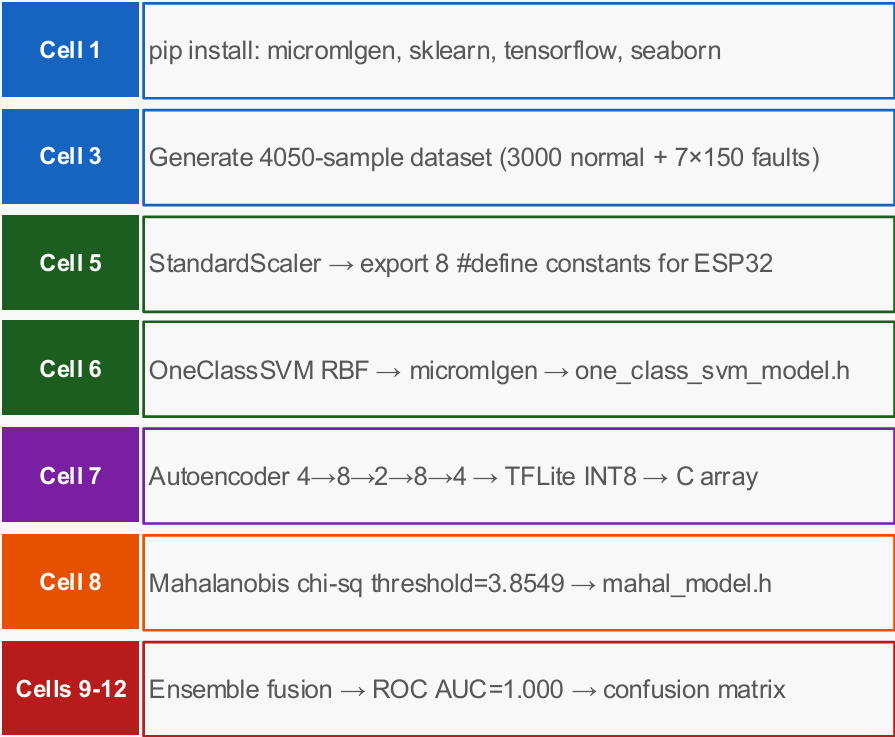

---

# Sensor Feature Distributions

Visualization of normal vs anomalous motor behavior across:

- RPM
- Current
- Vibration
- Temperature

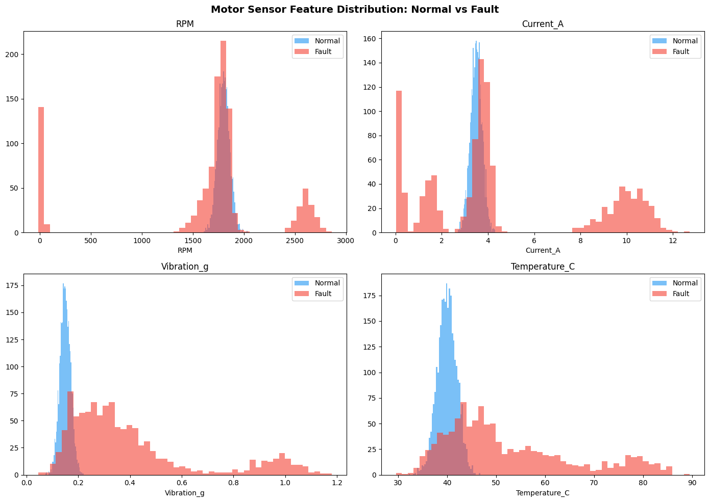

---

# Confusion Matrix

Ensemble fusion model classification performance.

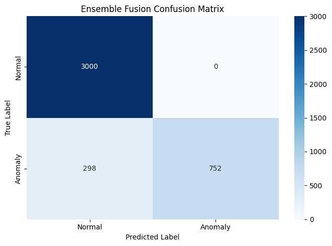

---

# Feature Correlation Matrix

Correlation analysis between all motor sensor parameters.

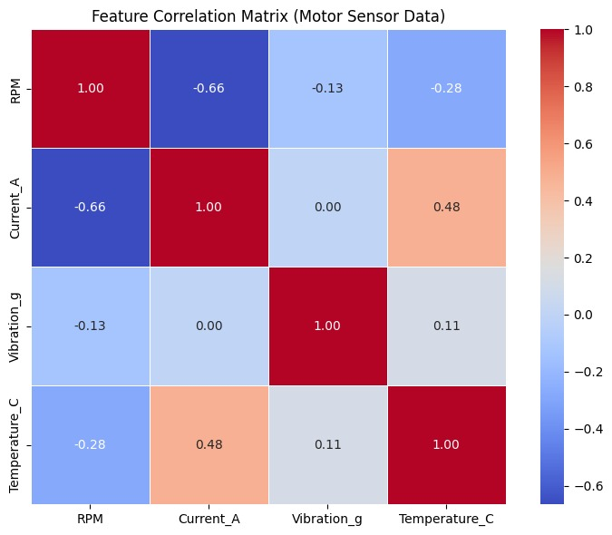

---

# ROC Curve Analysis

Performance comparison between:

- OneClassSVM
- Autoencoder
- Mahalanobis Distance
- Ensemble Fusion

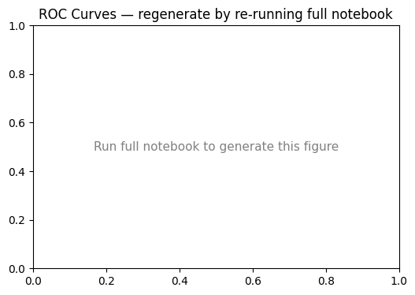

---

# Adaptive EMA Baseline Tracking

Dynamic baseline adaptation using Exponential Moving Average (EMA).

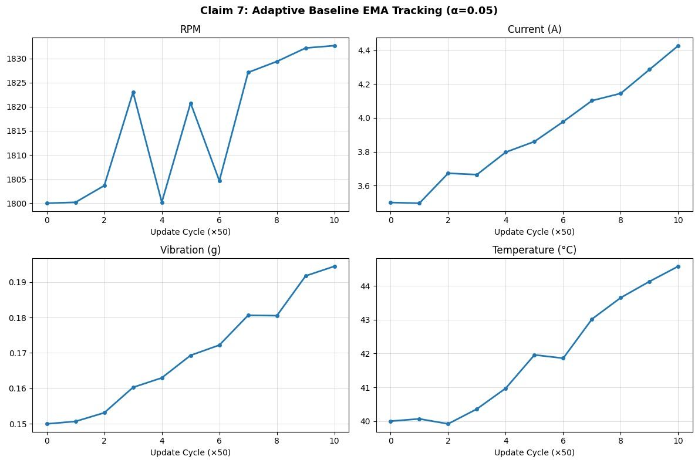

---

# Autoencoder Architecture

The Autoencoder compresses motor sensor patterns into latent representations for reconstruction-based anomaly detection.

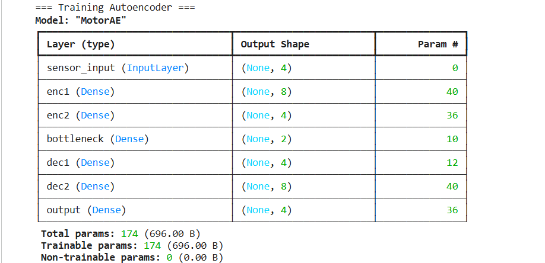

---

# OneClassSVM Results

The OneClassSVM model learns the normal operational boundary of the motor system.

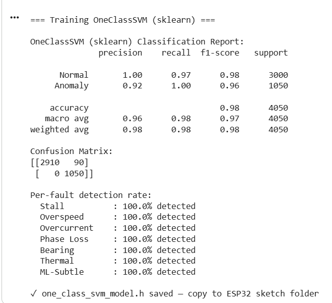

---

# Hardware Components

| Component | Purpose |
|---|---|
| ESP32 | Edge AI Controller |
| ACS712 | Current Sensing |
| MPU6050 | Vibration Analysis |
| DS18B20 | Temperature Monitoring |
| IR Sensor | RPM Measurement |
| L298N | Motor Driver |

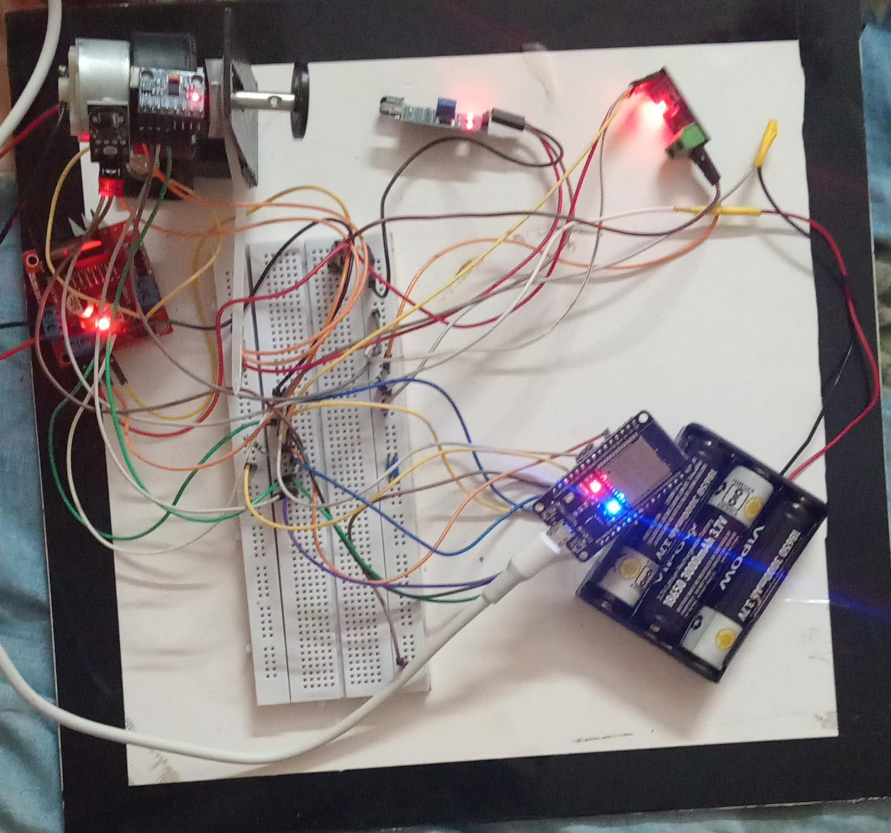

---

# Machine Learning Models

| Model | Purpose |
|---|---|
| OneClassSVM | Boundary anomaly detection |
| Autoencoder | Reconstruction anomaly detection |
| Mahalanobis Distance | Statistical anomaly detection |
| Ensemble Fusion | Final weighted fault scoring |

---

# Fault Detection Capability

The system detects:

- Stall conditions
- Overspeed faults
- Overcurrent faults
- Bearing wear anomalies
- Thermal overload
- Phase loss
- Subtle ML anomalies

---

# Performance Metrics

| Metric | Value |
|---|---|
| Ensemble ROC AUC | 1.000 |
| False Positive Rate | 0.00% |
| OneClassSVM Accuracy | 98% |
| Mahalanobis Accuracy | 99% |
| Inference Time | <1ms |
| Sampling Rate | 2Hz |

---

# Firmware Pipeline

```text
Sensor Readings
    ↓
Feature Scaling
    ↓
OneClassSVM Inference
    ↓
Autoencoder Reconstruction
    ↓
Mahalanobis Distance
    ↓
Fusion Scoring
    ↓
Fault Classification
```

---

# Repository Structure

```bash
Hybrid-Edge-AI-Motor-Fault-Detection/
│
├── README.md
├── docs/
├── firmware/
├── hardware/
├── ml/
├── results/
├── media/
└── data/
```

---

# Folder Descriptions

| Folder | Purpose |
|---|---|
| docs | Reports, diagrams, patent claims |
| firmware | ESP32 firmware and exported ML headers |
| hardware | Wiring diagrams and BOM |
| ml | ML training pipeline and visualizations |
| results | Evaluation outputs and metrics |
| media | Screenshots and visual outputs |
| data | Datasets and logs |

---

# Documentation & Presentation

## Project Report

Detailed project documentation:

```bash
docs/motor_fault_detector_report.docx
```

---

## Project Presentation

Presentation files:

```bash
docs/motor_fault_presentation.pdf
```

```bash
docs/motor_fault_presentation.pptx
```

---

# Firmware

The ESP32 firmware performs:

- Sensor acquisition
- Feature normalization
- ML inference
- Ensemble scoring
- EEPROM fault logging
- Self-healing control logic

Main firmware file:

```bash
firmware/motor_fault_detector.ino
```

---

# Dataset

The synthetic dataset contains:

- 3000 normal samples
- 1050 fault samples

Features:

- RPM
- Current
- Vibration
- Temperature

Dataset location:

```bash
data/synthetic_dataset.csv
```

---

# Media Outputs

The repository includes:

- Training screenshots
- ROC curve visualizations
- Confusion matrices
- Autoencoder outputs
- OCSVM outputs
- EMA tracking plots
- Correlation matrices

Media location:

```bash
media/
```

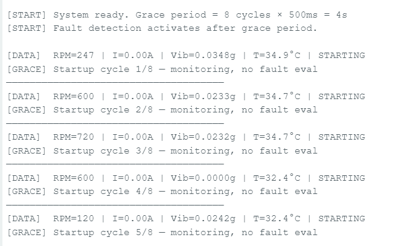

---

# Applications

- Industrial motor monitoring
- Smart factories
- Predictive maintenance
- HVAC systems
- Agricultural pumps
- Robotics
- EV motor monitoring

---

# Future Improvements

- MQTT cloud dashboard
- Mobile app integration
- Real industrial dataset collection
- TinyML optimization
- Quantized TensorFlow Lite deployment
- Transformer-based anomaly detection

---

# Patent-Relevant Innovations

- Edge-only AI inference
- Ensemble anomaly fusion
- Adaptive EMA baseline tracking
- Physics-aware anomaly validation
- Multi-layer intelligent fault detection

Patent claims available in:

```bash
docs/patent_claims.md
```

---

# Research Domains

- Edge AI
- TinyML
- Predictive Maintenance
- Industrial AI
- Embedded Machine Learning
- Explainable Anomaly Detection

---

# Deployment

The complete system runs directly on ESP32 hardware without cloud dependency.

Exported outputs include:

- OneClassSVM header
- Autoencoder header
- TFLite models
- ROC curves
- Confusion matrices

---


## Requirements
- numpy
- pandas
- matplotlib
- scikit-learn
- tensorflow
- micromlgen
- jupyter
- seaborn

# Author

**Kesihambigai S**  
B.Tech Electronics and Communication Engineering  
VIT University <br>
**Dishika G** <br>
B.Tech Electronics and Communication Engineering  <br>
VIT University


---
